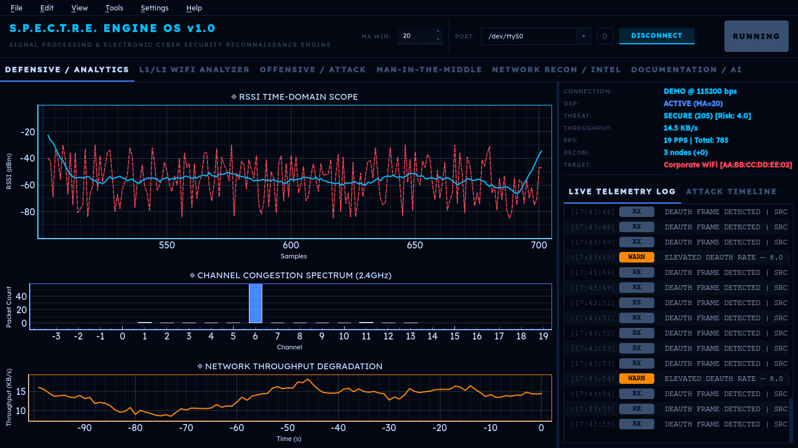
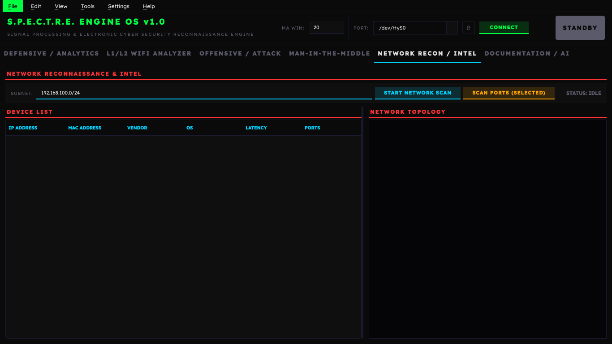
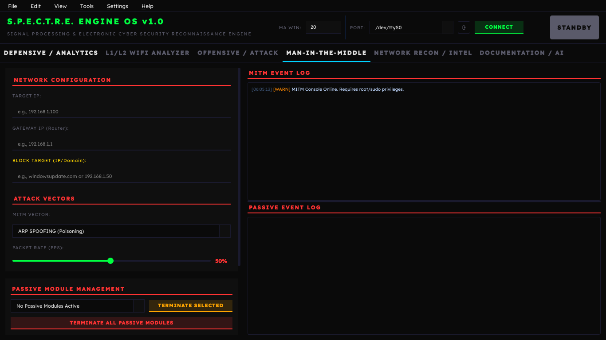
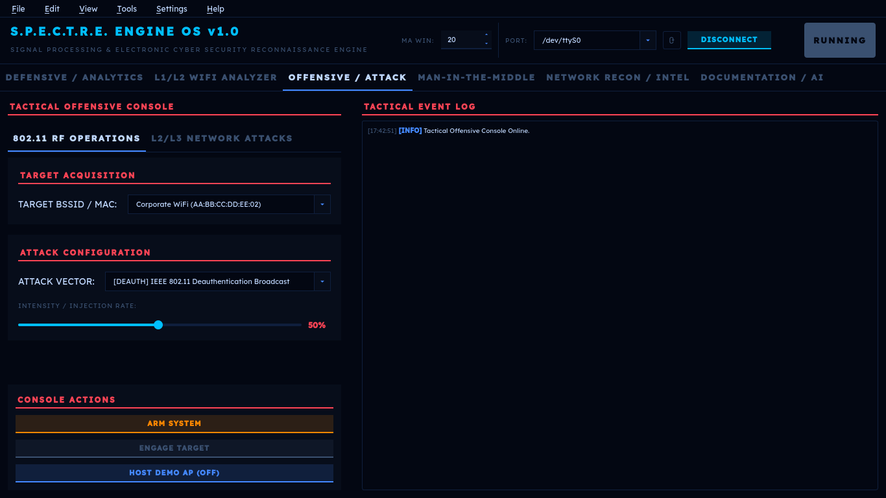

<p align="center">
  
</p>

# S.P.E.C.T.R.E. Engine OS

[](https://www.gnu.org/licenses/agpl-3.0)
[](https://www.python.org/downloads/)
[](https://doc.qt.io/qtforpython/)
[](#-cross-platform-notes)
[](#)

> [!WARNING]  
> **LEGAL DISCLAIMER:** This project is a dual-use security tool provided exclusively for **educational purposes, academic research, and authorized network security auditing**. Intercepting network traffic, performing Denial-of-Service (DoS) attacks, or creating rogue access points on unauthorized networks is strictly illegal. The maintainers are **NOT** responsible for any misuse of this framework. Please read the full [DISCLAIMER.md](DISCLAIMER.md) before proceeding.

**Signal Processing & Electronic Cyber Security Threat Reconnaissance Engine**

S.P.E.C.T.R.E. Engine OS is an advanced, real-time telemetry processing, spectrum visualization, and wireless diagnostics platform. It provides a comprehensive suite of defensive analytics, offensive operations, and man-in-the-middle (MITM) tools wrapped in a high-performance PySide6 graphical user interface.

---

## 📸 Screenshots

| Dashboard & Telemetry | Network Reconnaissance |
|:---:|:---:|
|  |  |
| **MITM & Harvester** | **Offensive Operations** |
|  |  |

*(L1/L2 details also available: [L2/L1 Overview](assets/l2l1.png))*

---

## 🚀 Features

### 🛡️ Defensive & Analytics
*   **Live Telemetry & DSP** — Real-time signal processing with dual-trace RSSI visualization (raw + smoothed), channel spectrum analysis, and payload throughput monitoring using `numpy` and `pyqtgraph`.
*   **Wi-Fi Analyzer** — Full-featured wireless scanner with Channel Occupancy Graph, Rolling Signal Strength History, Access Point Table, and Channel Rating system with congestion scoring.
*   **Sonar Mode** — Targeted single-SSID tracking mode that locks the scanner onto one network for deep analysis of its signal behavior over time.
*   **Reconnaissance Engine** — Automated ARP/ICMP-based network discovery of live hosts, open ports, rogue/honeypot access points, and hidden SSIDs.
*   **Intrusion Detection System (IDS)** — Rule-based IDS with live traffic rate calculation to detect anomalies like Deauth Floods, Beacon Spam, and Probe Storms. Visual `MONITORING` and `TRIGGERED` states with per-rule status tracking.
*   **Threat Monitor** — Sliding-window deauthentication attack detection with source concentration analysis and persistence tracking. Distinguishes real attacks from network congestion.
*   **PMKID Capture Simulation** — Simulated PMKID/EAPOL handshake capture for educational demonstration of WPA2 key exchange vulnerabilities.
*   **Timeline Event Logging** — Persistent event timeline that logs attacks, reconnections, threat level changes, and IDS triggers with timestamps.

### ⚔️ Offensive Operations
*   **802.11 RF Attacks** — Deauthentication floods, Beacon spamming, and Probe request storms via ESP32 hardware interface.
*   **L2/L3 Network Attacks** — ARP floods, DHCP starvation, DNS floods, and ICMP Ping storms using Scapy.
*   **Network Topology Map** — Interactive visualization of discovered network devices and their relationships.
*   **Hardware Integration** — An ESP32 microcontroller serves as the dedicated radio interface for physical L1/L2 and 802.11 wireless pentesting (RF transmission, spoofing, signal injection).

### 🕵️‍♂️ Man-In-The-Middle (MITM)
*   **ARP Spoofing (Poisoning)** — Active ARP cache poisoning to intercept traffic between a target and the gateway.
*   **DNS Spoofing (Redirection)** — Forge DNS responses to redirect victim traffic to the attacker's machine.
*   **Credential Harvester** — Passive HTTP credential harvesting with dual-pane real-time logging (separating active alerts from harvested data).
*   **Payload Injector** — Inject JavaScript payloads (alert boxes, page redirects, custom scripts) into intercepted HTTP responses.
*   **Session Hijacking Test** — Demonstrate session cookie theft and replay in a controlled environment.
*   **Dynamic Web Server** — Built-in HTTP server that dynamically hosts `mitm_demo_site` on Port 80. The L2 Engine intercepts UDP Port 53 queries and forges DNS responses to redirect victims to this server.

### 🎨 UI & Customization
*   **Multi-Theme Engine** — Four built-in themes: Dark Hacker (green matrix), Deep Blue (naval radar), Blood Red (crimson), and Monochrome (silver). Theme changes apply instantly with no restart required.
*   **Configurable Font Sizes** — Per-region font scaling (Global UI, Menu Bar, Labels, Buttons, Event Log, Tables, Plot Axes) with live preview.
*   **AI Assistant** — Groq-powered (LLaMA 3.3 70B) AI assistant for vendor lookups (OUI database), network diagnostics, and contextual help.
*   **Splash Screen** — Cinematic intro video with audio on application startup.
*   **Settings Panel** — Full settings dialog with Appearance, Performance (FPS, antialiasing, OpenGL), and About tabs.

---

## 💻 Hardware Architecture: The Edge Sensor Node

S.P.E.C.T.R.E. utilizes an ESP32 microcontroller as a dedicated physical layer interceptor. By isolating the hardware radio from the host PC, the ESP32 can run its 2.4 GHz antenna in pure Promiscuous Mode, catching raw 802.11 frames and filtering them before transmitting telemetry via USB.

### Pinout Matrix

The physical navigation cluster relies on the ESP32's internal pull-up resistors (`INPUT_PULLUP`). Wire the tactile buttons directly to Ground (GND)—no external resistors are required.

| Component | ESP32 GPIO | Interface Type | Function Description |
| --- | --- | --- | --- |
| **ST7735 TFT Screen** | `GPIO 18` | SPI (SCK) | Clock Signal (SCL/SCK) |
| **ST7735 TFT Screen** | `GPIO 23` | SPI (MOSI) | Data Transmission (SDA/MOSI) |
| **ST7735 TFT Screen** | `GPIO 4` | Digital Out | Hardware Reset (RES/RST) |
| **ST7735 TFT Screen** | `GPIO 2` | Digital Out | Data/Command Toggle (DC/A0) |
| **ST7735 TFT Screen** | `GPIO 5` | SPI (CS0) | Chip Select (CS/CE) |
| **ST7735 TFT Screen** | `3V3` | Power | Backlight (BLK/LED) - *Always on* |
| **Navigation: UP** | `GPIO 13` | Digital In | Menu Up / Disengage Link |
| **Navigation: SELECT** | `GPIO 12` | Digital In | Menu Select / Arm Stream |
| **Navigation: DOWN** | `GPIO 14` | Digital In | Menu Down |
| **PC Bridge** | `USB TX/RX` | UART | 115200 Baud Telemetry Link |

### Power & Routing Notes

* **Logic Levels:** The ST7735 logic requires **3.3V**. Do not bridge the `VCC` or `LED` pins to the 5V/VIN rail, as this will damage the display controller.
* **Common Ground:** Ensure all tactile buttons and the TFT display share a common ground (`GND`) with the ESP32.
* **Capacitive Filtering:** The ESP32's RF amplifier draws high transient currents during active packet injection or dense promiscuous sniffing. It is recommended to place a `10µF` capacitor across the `3V3` and `GND` rails to prevent brown-out resets.

---

## 📂 Directory Structure

```text
Spectre/
├── core/                       # Backend engines & business logic
│   ├── ai/                     #   AI assistant & Groq vendor lookup
│   ├── analytics/              #   DSP, IDS, threat detection, spectrum analysis
│   ├── hardware/               #   ESP32 telemetry, simulator, sonar engine
│   ├── mitm/                   #   ARP spoof, DNS spoof, harvester, injector, sniffer
│   ├── network/                #   L2 engine, network scanner, port scanner, recon
│   ├── oui/                    #   IEEE OUI MAC-address vendor database
│   ├── settings_manager.py     #   Persistent app settings (JSON)
│   ├── theme_manager.py        #   Runtime theme engine (palette → config → QSS)
│   └── web_server.py           #   Dynamic HTTP server for MITM demonstrations
├── esp32/                      # C++ firmware for the ESP32 edge sensor
├── mitm_demo_site/             # HTML/JS assets served during DNS Spoofing
├── styles/                     # QSS stylesheet builder & pyqtgraph theming
├── ui/                         # PySide6 GUI layer
│   ├── attack/                 #   802.11 RF & L2/L3 attack panel
│   ├── main_window/            #   Main window (split into handler mixins)
│   ├── mitm/                   #   MITM control panel (config, controls, logs, payload)
│   ├── right_panel/            #   Event log, IDS rules, status indicators, timeline
│   ├── settings/               #   Settings dialog (appearance, performance, about)
│   └── wifi_analyzer/          #   Channel graph, time graph, AP table, ratings
├── assets/                     # Media, screenshots, intro video, SVG icons
├── main.py                     # Application entry point
├── config.py                   # Global colour constants, thresholds, tuning
├── requirements.txt            # Python dependencies
└── .env                        # API keys (git-ignored)
```

---

## 🛠️ Installation

### 1. Prerequisites
*   Python **3.10+**
*   `git`
*   (Optional) [Npcap](https://npcap.com/) on Windows — required for Scapy raw-socket features

### 2. Clone & Setup

```bash
git clone https://github.com/mynameissami/Spectre.git
cd Spectre
python -m venv .venv
```

Activate the virtual environment:

| OS | Command |
|---|---|
| **Linux / macOS** | `source .venv/bin/activate` |
| **Windows (cmd)** | `.venv\Scripts\activate.bat` |
| **Windows (PowerShell)** | `.venv\Scripts\Activate.ps1` |

### 3. Install Dependencies

```bash
pip install -r requirements.txt
```

### 4. Configuration (Optional)

If you want the AI Assistant module, create a `.env` file in the root directory:

```env
GROQ_API_KEY="your_api_key_here"
```

---

## 💻 Usage

### Demo Mode (No Hardware Required)
If you do not have an ESP32 connected, you can run S.P.E.C.T.R.E. in software simulation mode:

**Linux / macOS**
```bash
./.venv/bin/python main.py --demo
```

**Windows**
```cmd
.venv\Scripts\python.exe main.py --demo
```
This generates synthetic telemetry and fake AP targets, allowing you to explore the UI and features.

### Linux (Full Hardware Mode)
```bash
sudo ./.venv/bin/python main.py
```

### macOS
```bash
sudo ./.venv/bin/python main.py
```

### Windows (Administrator Command Prompt)
```cmd
.venv\Scripts\python.exe main.py
```

> [!NOTE]
> Root/Administrator privileges are required for raw socket access (Scapy), binding to port 80 (MITM web server), and ESP32 serial port access.

### Modes of Operation
*   **Hardware Mode:** Flash the firmware in `esp32/` to an ESP32 microcontroller. Select the COM port and click **CONNECT** to stream live serial telemetry.
*   **Demo Mode:** Click **DEMO** on the connection banner to launch the built-in simulator, which generates synthetic telemetry and network traffic to showcase the UI without hardware.

---

## 🌍 Cross-Platform Notes

S.P.E.C.T.R.E. is built with PySide6 (Qt) and Python, making it inherently cross-platform. However, some features depend on OS-level networking capabilities:

| Feature | Linux | macOS | Windows |
|---|:---:|:---:|:---:|
| GUI (all panels, themes, settings) | ✅ | ✅ | ✅ |
| ESP32 Hardware Mode (serial) | ✅ | ✅ | ✅ |
| Demo / Simulator Mode | ✅ | ✅ | ✅ |
| AI Assistant (Groq API) | ✅ | ✅ | ✅ |
| Scapy Attacks (ARP, DNS, L2) | ✅ | ✅ | ✅ ¹ |
| MITM (ARP/DNS Spoofing) | ✅ | ✅ | ✅ ¹ |
| Network Scanner (ARP discovery) | ✅ | ✅ | ✅ ¹ |
| Splash Video (FFmpeg backend) | ✅ | ✅ | ✅ ² |

**Notes:**
1. **Windows:** Install [Npcap](https://npcap.com/) (check *"Install Npcap in WinPcap API-compatible mode"* during install). Npcap provides the raw socket layer that Scapy needs. Run the application as **Administrator**.
2. **Windows/macOS:** Qt's multimedia backend may require FFmpeg codecs. If the splash video doesn't play, it can be safely skipped — it doesn't affect functionality.
3. **macOS:** BPF (Berkeley Packet Filter) devices require `sudo` for raw packet capture.

---

### How DNS Spoofing & Credential Harvesting Works
1. Navigate to the **MAN-IN-THE-MIDDLE** tab.
2. Select **DNS SPOOFING (Redirection)** or **CREDENTIAL HARVESTER**.
3. Once engaged, S.P.E.C.T.R.E. starts the background `DynamicWebServer` on `0.0.0.0:80`.
4. The `MITMEngine` begins listening for UDP traffic on Port 53.
5. When a device on the network requests a website (e.g., `http://example.com`), S.P.E.C.T.R.E. intercepts the DNS request and responds with the IP address of your machine (auto-detected at runtime).
6. The victim's browser is transparently routed to the `mitm_demo_site` hosted by S.P.E.C.T.R.E., simulating an interception or credential gathering scenario.

---

## 📜 License

This project is licensed under the [GNU Affero General Public License v3.0](LICENSE).

**Disclaimer:** *This software is designed exclusively for educational purposes and authorized network security auditing. Users are responsible for adhering to all applicable local, state, and federal laws.*